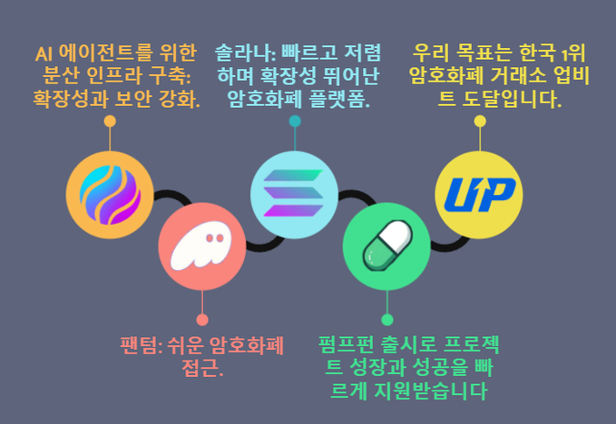

# 파라다이스 (Paradise)

**파라다이스**는 인공지능(AI) 에이전트를 지원하기 위해 설계된 탈중앙화 인프라 프로젝트로, Solana 블록체인과 업비트 코리아를 활용하여 안전하고 확장 가능하며 효율적인 탈중앙화 솔루션을 제공합니다.

---

## AI를 위한 탈중앙화 인프라

AI 시스템의 빠른 발전과 더불어 인프라 요구사항도 증가하고 있습니다. 파라다이스는 다음과 같은 방법으로 이를 해결합니다:

1. **확장성**: Solana의 고성능 블록체인을 활용하여 AI 워크로드 지원.
2. **보안성**: 블록체인의 암호화 기반으로 데이터 무결성과 사용자 프라이버시 보장.
3. **상호운용성**: AI 에이전트 및 도구와의 원활한 통합.
4. **투명성**: 탈중앙화 운영을 통해 신뢰할 수 있는 AI 시스템 구축.

우리는 탈중앙화 인프라가 AI 시스템의 구축, 배포 및 활용 방식을 전 세계적으로 혁신할 것이라 믿습니다.

---

## 프로젝트 로드맵

파라다이스의 성공을 위해 아래와 같은 여정을 계획했습니다:



1. **1단계**: 초기 개발  
   - Solana 및 팬텀 지갑을 활용한 지갑 통합.  
   - 안전하고 반응형 웹 인터페이스 설계.  

2. **2단계**: 인프라 확장  
   - AI 운영을 위한 탈중앙화 API 배포.  
   - Solana 최적화를 통한 확장성 향상.  

3. **3단계**: 완전한 탈중앙화 AI 통합  
   - 탈중앙화 머신러닝 모델 호스팅 지원.  
   - AI 도구를 위한 개발자 친화적 생태계 구축.  

4. **4단계**: 커뮤니티 및 생태계 성장  
   - 파트너십을 통해 사용자 채택 확대.  
   - 프로젝트 강화를 위한 커뮤니티 주도 이니셔티브 출범.  

---

## 시작하기

### 사전 준비

1. Solana 블록체인 상호작용을 위한 [Phantom Wallet](https://phantom.app/) 설치.
2. 이 저장소를 클론:
   ```bash
   git clone https://github.com/Bitgaramso/paradise.git
   cd paradise

